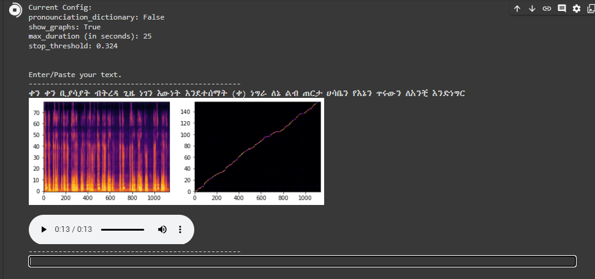

<h1 align="center">Amharic-Text-to-speech</a></h1>

-  Audio sample at sound cloud - <a href="https://soundcloud.com/moan-bekele/download-11?si=5c9dfe63d0664a65bc20802c3a701067&utm_source=clipboard&utm_medium=text&utm_campaign=social_sharing">
  sample.wav
</a>

<h3 align="left"><u>Samples</u></h3>
 <video src="https://github.com/moanbekele/Amharic-Text-to-speech/blob/main/download%20(11).mov" controls="controls" style="width: 100%"></video>

- I used a dataset of approximately 2 hours audio and text data for this results ,I used lyrics from  kassmase songs as a text dataset and my voice as the audio.
-   holds the code responsibe for training the tacotron model  

- 📫 Directory For audio **/wavs** , Audio should be formated project rate(hz) to 22050!

- 📄 Know about my experiences <a href="https://github.com/100rabhcsmc/Me.io/blob/master/01SaurabhChavanReactNativeResume.pdf" target="blank">Resume</a>
 
<h3 align="left"><u>Main Resources Used</u></h3>

-  Tacotron 2 <a href="https://github.com/NVIDIA/tacotron2" target="blank">https://github.com/NVIDIA/tacotron2</a>

-  Waveglow <a href="https://phoenix.tech/griffyn/" target="blank">https://phoenix.tech/griffyn/</a>
 
<h3 align="left"><u>Training</u></h3>
 
- I used a dataset of approximately 2 hours audio and text data for this results ,I used lyrics from  kassmase songs as a text dataset and my voice as the audio.
-   holds the code responsibe for training the tacotron model  

- 📫 Directory For audio **/wavs** , Audio should be formated project rate(hz) to 22050!

- 📄 Know about my experiences <a href="https://github.com/100rabhcsmc/Me.io/blob/master/01SaurabhChavanReactNativeResume.pdf" target="blank">Resume</a>
 
<h3 align="center" > Connect with me 🤝 </h3>

 

        
        
		
	   
        
		
		
		
      

### Blogs posts

<!-- BLOG-POST-LIST:START -->

- [Install Tacotron 2](https://dev.to/100rabhcsmc/instagram-profile-picture-download-using-python-n2j)
- [Convert a image to sketch using python](https://dev.to/100rabhcsmc/convert-a-image-to-sketch-using-python-3ip1)
- [Upload your project/files in GitHub using commands](https://dev.to/100rabhcsmc/upload-your-project-files-in-github-using-commands-1hn8)
<!-- BLOG-POST-LIST:END -->

---

Credit: [Saurabh Chavan](https://github.com/100rabhcsmc)

Last Edited on: 08/08/2022
